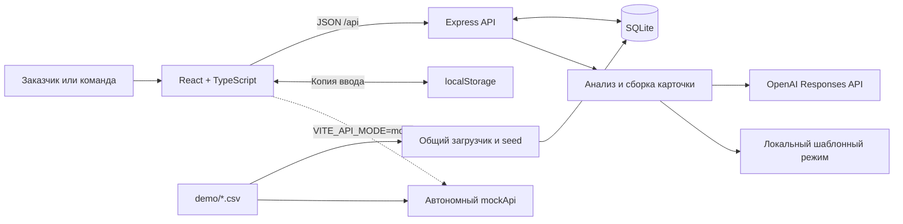

# AI Sana — от потребности бизнеса к студенческому проекту

**AI Sana** помогает заказчику превратить описание проблемы в понятное задание, а студенческой команде — найти задачу и предложить решение. AI уточняет недостающие сведения, предлагает структуру карточки и тему для поиска. Заказчик проверяет информацию, публикует задание и выбирает команды по их откликам.

Хакатонный MVP команды **AbaD3v**. Репозиторий: [BAITC-Hacks/hack-24c03e7c-abad3v](https://github.com/BAITC-Hacks/hack-24c03e7c-abad3v).

**Для жюри:** [установка и запуск](#установка-и-запуск) · [сценарий демонстрации](#как-проверить-решение) · [ограничения](#ограничения) · [развёрнутая версия](#развёрнутая-версия)

## Какую проблему решает проект

Короткого запроса вроде «нужен сервис для поиска аудиторий» недостаточно, чтобы команда поняла объём работы, доступные данные и критерии приёмки. Заказчику приходится отдельно составлять техническое задание, а студентам — выяснять условия до начала проекта.

AI Sana организует этот процесс в одном пространстве:

- **Бизнесу и организациям-заказчикам** — помогает сформулировать потребность, проверить полноту задания и сравнить предложения команд.
- **Студенческим командам** — предоставляет каталог опубликованных задач с условиями, ожидаемым результатом и возможностью отправить отклик.

Образовательный сценарий реализуется через работу студентов над прикладными задачами. Тематика заданий свободная: пользователь описывает проблему, а помощник предлагает направление по её содержанию.

## Что реализовано

### Пространство бизнеса

- Список задач, продолжение черновика, счётчики публикаций и откликов.
- Создание задачи из свободного описания; пустое открытие формы не создаёт запись.
- Пошаговый редактор: описание → уточнение → проверка → публикация.
- AI-предложение карточки, вопросы с вариантами ответов, собственный ответ и действие «Пока не знаю».
- Автоматическое предложение темы для поиска без закрытого списка отраслей.
- Редактирование полей и темы, просмотр цитат для извлечённых AI сведений, защита ручных изменений при повторном анализе.
- Автосохранение, восстановление локального ввода и обработка конфликтов версий.
- Отдельные рабочая, подтверждённая и опубликованная версии. Изменения черновика становятся публичными после подтверждения и явного обновления публикации.
- Просмотр откликов, сравнение 2–3 предложений на одну задачу, выбор или отклонение команд. Решение можно изменить; допускается выбрать несколько команд.

### Пространство студенческой команды

- Каталог с поиском по названию, теме и содержанию; фильтры по направлению и готовности.
- Направления фильтра формируются из тем опубликованных задач. Сначала показываются задачи с большей полнотой описания.
- Страница задания: проблема, пользователи, результат, критерии, данные, срок и связь с заказчиком.
- Отклик с подходом, планом, сроком и ссылкой на прототип.
- Раздел «Мои отклики» со статусами «На рассмотрении», «Команда выбрана» и «Отклонено».

### Объяснимая полнота задания

Backend вычисляет балл **0–100** по заполнению потребности, данных, результата, критериев успеха, ограничений, пользователей и контакта. Интерфейс показывает разбивку и недостающие сведения. Предварительная полнота черновика отделена от последнего подтверждённого балла.

Это показатель полноты постановки задачи. Он не оценивает способности студентов или качество будущего решения. AI не назначает баллы. Публикация доступна при любом балле после подтверждения и заполнения содержательного названия.

## Как работает решение

1. **Описание.** Заказчик вводит проблему. Сохраняется приватный черновик.
2. **Анализ.** Backend передаёт описание и доступные сведения помощнику. В живом режиме модель извлекает факты с цитатами, предлагает тему и 3–5 уточняющих вопросов.
3. **Уточнение.** Заказчик выбирает предложенные ответы, пишет свои или пропускает неизвестное. Ответы дополняют карточку; при переходе к проверке выполняется сборка карточки из накопленных сведений.
4. **Проверка.** Заказчик исправляет формулировки, изучает полноту и подтверждает сведения. Предложения AI остаются проверяемыми и редактируемыми.
5. **Публикация.** Backend сохраняет публичный снимок. Задача появляется в каталоге вместе с темой и подтверждённой полнотой.
6. **Отклик и решение.** Команда отправляет предложение. Заказчик сравнивает отклики и вручную выбирает исполнителей.

Результат сценария — опубликованное задание с условиями и сохранённые отклики команд с решениями заказчика. AI помогает подготовить постановку; публикацию и выбор команды выполняет человек.

## Технологии

| Компонент | Реализация |
|---|---|
| Frontend | TypeScript, React, Vite, обычный CSS; маршруты через URL hash |
| Backend | JavaScript ES modules, Node.js, Express 5; JSON API |
| Валидация | Zod, серверные проверки полей и ревизий |
| Хранение | SQLite через встроенный `node:sqlite`, режим WAL; локальная копия ввода в `localStorage` |
| Живой AI | Серверный OpenAI SDK, Responses API, Structured Outputs с JSON Schema |
| Модель | По умолчанию в коде — `gpt-6-sol`; в списке поддерживаемых бюджетным учётом моделей также есть `gpt-6-luna` |
| Работа без внешнего AI | Общие локальные правила извлечения, уточнений и определения темы |
| Демо-данные | Четыре CSV-файла и общий загрузчик для сервера и автономного frontend |
| Разработка и проверки | npm workspaces, concurrently, TypeScript compiler, встроенный `node:test` |

Фактические зависимости и команды: [package.json](package.json), [server/package.json](server/package.json).

## Архитектура проекта



В разработке Vite проксирует `/api` на Express. После сборки Express может отдавать и `dist/`, и API с одного адреса. В обычном режиме SQLite хранит профили, задачи, вопросы и ответы, снимки карточек, отклики, AI-предложения, кэш и учёт вызовов. Backend проверяет роль и владельца задачи; ревизии защищают от перезаписи более свежих изменений.

```text
src/
  App.tsx                 # Навигация, выбор демо-профиля
  TaskEditor.tsx          # Создание, уточнение и публикация задачи
  WorkspacePages.tsx      # Рабочая область, каталог, отклики
  editorModel.ts          # Объединение предложений и защита правок
  api.ts / mockApi.ts     # Настоящий API и автономный режим
server/
  src/app.js              # HTTP API, роли, состояния и AI-бюджет
  src/ai.js               # Промпт, JSON Schema, вызов OpenAI
  src/template.js         # Работа помощника без внешней модели
  src/card.js / db.js     # Валидация, полнота и SQLite
  src/seed.js             # Загрузка демо-данных
  evals/                  # Отдельная оценка живой модели
  test/                   # Серверные тесты
shared/                   # Контракт, CSV-загрузчик, темы и варианты ответов
demo/                     # Синтетические CSV
test/                     # Тесты логики frontend
docs/                     # Требования и отчёт о качестве AI
```

Контракт запросов, ошибок и состояний: [shared/CONTRACT.md](shared/CONTRACT.md). Актуальный продуктовый сценарий: [docs/CASE.md](docs/CASE.md). [HACKATHON_PLAN.md](HACKATHON_PLAN.md) — исходный план; часть его пунктов осталась за пределами реализации.

## Установка и запуск

### 1. Подготовить окружение

Нужны **Git**, **Node.js 24.x не ниже 24.2.0** и npm. SQLite устанавливать отдельно не нужно. Интернет нужен для установки пакетов и вызовов живой модели; для локального шаблонного режима после установки пакетов ключ AI не требуется.

Команды ниже приведены для **PowerShell в Windows**. На macOS/Linux используйте `npm` вместо `npm.cmd`, а вместо `Copy-Item` — `cp`.

```powershell
git clone https://github.com/BAITC-Hacks/hack-24c03e7c-abad3v.git
cd hack-24c03e7c-abad3v
node --version
npm.cmd install
```

Если репозиторий уже скачан, перейдите в его корень. Все следующие команды выполняются из корня, а не из `server/`.

### 2. Загрузить данные и запустить приложение

```powershell
npm.cmd run seed
npm.cmd run dev
```

- Откройте **[frontend на localhost:5173](http://localhost:5173)** или адрес, который напечатает Vite, если порт занят.
- Backend по умолчанию слушает порт `3001`. [Проверка доступности API](http://localhost:3001/api/health) возвращает `{"status":"ok","db":"ok"}`.
- `dev` запускает API и Vite одновременно. Терминал должен оставаться открытым; остановка — `Ctrl+C`.
- При первом входе выбирается «Карьерный центр», далее браузер помнит последний профиль. Роли переключаются через меню профиля в шапке.

По умолчанию frontend работает с настоящим локальным API. Если ключ OpenAI не задан, помощник использует локальные правила; задачи и отклики всё равно сохраняются в SQLite.

`seed` синхронизирует примеры с CSV без дубликатов. **Повторный запуск восстанавливает содержание и статусы демо-записей из CSV**, поэтому изменения этих примеров могут быть заменены. Созданные через интерфейс пользовательские задачи сохраняются.

### 3. Подключить живую модель — необязательно

Если `server/.env` ещё не существует:

```powershell
Copy-Item server/.env.example server/.env
```

Откройте `server/.env`, заполните `OPENAI_API_KEY` своим ключом и оставьте `AI_MODE=auto`. Перезапустите backend. Ключ хранится только на сервере; не добавляйте его в `VITE_*`, исходники или Git.

| Переменная | Файл / значение по умолчанию | Назначение |
|---|---|---|
| `PORT` | `server/.env`: `3001` | Порт API |
| `DB_PATH` | `server/.env`: `./data/ai-sana.sqlite` | Путь к SQLite относительно каталога `server/` |
| `OPENAI_API_KEY` | `server/.env`: пусто | Ключ для живого AI |
| `OPENAI_MODEL` | `server/.env`: `gpt-6-sol` | Модель из поддерживаемого в коде списка |
| `AI_MODE` | `server/.env`: `auto` | `template` принудительно включает локальный помощник |
| `AI_BUDGET_CAP_USD` | `server/.env`: `15` | Общий накопительный лимит по внутреннему учёту в этой БД |
| `VITE_API_MODE` | `.env.local`: `api` | `api` — сервер; `mock` — автономная демонстрация |
| `VITE_API_BASE` | `.env.local`: `/api` | Базовый путь запросов frontend |
| `VITE_API_TARGET` | `.env.local`: `http://localhost:3001` | Адрес API для прокси Vite |

Файлы `.env` необязательны для запуска с настройками по умолчанию. Если меняете порт backend, задайте соответствующий `VITE_API_TARGET` и перезапустите Vite. Изменения `VITE_*` в собранной версии требуют новой сборки.

### Другие режимы запуска

**Собранное приложение с одним адресом:** остановите прежние процессы разработки, затем выполните:

```powershell
npm.cmd run build
npm.cmd start
```

Откройте [localhost:3001](http://localhost:3001). Backend отдаёт сборку из `dist/` и API. После изменения frontend повторите сборку. Без `dist/` на этом порту доступен только API.

**Отдельные процессы:** `npm.cmd run dev:server` запускает только API, `npm.cmd run dev:client` — только Vite. При таком запуске используйте два терминала.

**Автономный frontend:** создайте `.env.local` из [.env.example](.env.example), если файла ещё нет, задайте `VITE_API_MODE=mock` и запустите `npm.cmd run dev:client`. В этом режиме сервер и OpenAI не используются, данные хранятся в браузере. Они не синхронизируются с SQLite. Для возврата к API задайте `VITE_API_MODE=api` и перезапустите Vite.

**Если запуск не удался:**

- `ERR_MODULE_NOT_FOUND` для `express` — выполните `npm.cmd install` из корня репозитория.
- `EADDRINUSE` для `3001` — остановите прежний backend через `Ctrl+C`; если он уже нужен и работает, запустите только `dev:client`.
- `Cannot GET /` на `3001` — в режиме разработки открывайте адрес Vite; для одного адреса сначала выполните сборку и перезапустите API.
- Предупреждение об экспериментальном `node:sqlite` само по себе не означает ошибку запуска.

## Как проверить решение

### Сценарий для жюри

После `seed` и запуска можно пройти весь путь с демо-профилями. Для локальной демонстрации задайте `AI_MODE=template` на сервере; для оценки живой модели используйте ключ и `AI_MODE=auto`. Точные формулировки живого AI могут различаться.

1. Выберите профиль **«Карьерный центр»**, откройте **«Мои задачи» → «Создать задачу»**.
2. Введите описание и нажмите **«Подготовить задание»**:

   > Студенты вручную ищут свободные аудитории и теряют время. Нужен веб-прототип со списком помещений и свободных временных слотов. Прототипом будут пользоваться студенты университета.

3. Посмотрите предложенную карточку, тему для поиска и вопросы. Раскройте источник одного заполненного поля. В режиме без ключа интерфейс показывает **«Шаблонный помощник»**.
4. Уточните сведения через вопросы или редактирование разделов карточки:

   | Поле | Пример ответа для демонстрации |
   |---|---|
   | Доступность данных | «Планируем получить» |
   | Материалы и источник | «Для демонстрации подготовим синтетическую таблицу помещений и временных слотов» |
   | Показатель успеха | «Из пяти студентов минимум четверо находят аудиторию без подсказки» |
   | Срок | «Гибкий срок» |

   Это вводимые участником примеры, а не утверждение о наличии такого файла в репозитории. Можно выбрать «Пока не знаю»: неизвестное не должно увеличивать полноту.

5. Исправьте название на **«Поиск свободных аудиторий — демо жюри»**. При необходимости исправьте тему. Нажмите **«Перейти к проверке»**: ручные правки должны сохраниться после повторного анализа. Дождитесь состояния **«Все изменения сохранены»**, обновите страницу и продолжите с того же задания. Для перехода без ещё одного вызова модели есть **«Проверить без повторного анализа»**.
6. Отметьте подтверждение сведений и нажмите **«Подтвердить и опубликовать»**. Низкая полнота не препятствует публикации, если есть содержательное название.
7. Переключитесь на **Qadam**, откройте **«Каталог задач»**, найдите новое задание по названию или теме и нажмите **«Подробнее» → «Предложить решение»**. Заполните подход, план и срок. Для синтетического примера ссылки можно указать `https://example.org/ai-sana-demo` — это заглушка, не работающий прототип. Нажмите **«Отправить отклик»**.
8. Вернитесь в **«Карьерный центр» → «Отклики команд»**, выберите созданную задачу и нажмите **«Выбрать команду»** у её отклика. В профиле Qadam проверьте результат в **«Мои отклики»**.

Для сравнения готовых предложений откройте в бизнес-профиле отклики на **«Единый каталог стажировок для выпускников»**. Отметьте **«Сравнить Orbit»** и **«Сравнить Sana Labs»**, затем нажмите **«Сравнить команды»**. Обе команды уже выбраны в исходных CSV; изменить решение можно через **«Изменить решение»**.

Дополнительно отредактируйте опубликованное задание: появится отметка «Есть неопубликованные изменения». Команды получат новую версию только после **«Подтвердить и обновить»**.

### Проверки из репозитория

```powershell
npm.cmd test
npm.cmd run build
```

Тесты охватывают API и роли, ревизии, миграции, расчёт полноты, обработку AI-ответов, объединение правок, неизвестные значения, варианты ответов, mock API и пагинацию. Обычный набор тестов не вызывает платный API. Команды приведены для самостоятельного запуска в вашем окружении.

Отдельный набор оценки живого AI:

```powershell
# Показать сценарии без запросов к модели
npm.cmd run eval:ai

# Платный прогон с ключом из server/.env
npm.cmd run eval:ai -- --live --budget=0.50
```

Можно выбрать сценарии: `--case=rooms-sparse` или несколько ID через запятую; отчёт сохраняется в `server/data/evals/`. Лимит запуска и общий `AI_BUDGET_CAP_USD` основаны на внутренней оценке расходов. Не запускайте этот прогон одновременно с другими платными AI-сессиями приложения: у них отдельный путь резервирования бюджета.

В [отчёте о качестве](docs/MODEL_QUALITY.md) сохранён исторический прогон восьми синтетических сценариев: семь ответов приняты приложением, один отклонён валидатором. Он выполнен на коммите `8d2fac3` с промптом `v5-guided-answers`. Текущий промпт — `v6-free-topics`; прежний отчёт не подтверждает качество новой классификации тем и не заменяет проверку текущей версии.

## Данные и интеграции

| Источник | Что содержит / как используется |
|---|---|
| [demo/tasks.csv](demo/tasks.csv) | Пять исходных описаний задач, темы и отрасли |
| [demo/cards.csv](demo/cards.csv) | Пять опубликованных карточек с полнотой 10, 40, 65, 80 и 100 |
| [demo/profiles.csv](demo/profiles.csv) | Пять команд: Qadam, Orbit, Sana Labs, CodeOrda и GreenByte |
| [demo/applications.csv](demo/applications.csv) | Пять связанных с задачами откликов и их исходные статусы |
| SQLite | Созданные пользователем задачи, изменения карточек, отклики и серверное состояние |
| OpenAI Responses API | Живые предложения полей, тем и уточнений; вызывается только backend |

Все стартовые CSV-данные синтетические. Ссылки и контакты на `example.org` служат примерами. Описанные внутри задач наборы, например библиотечные выдачи или объявления стажировок, не означают подключения к реальным системам этих организаций.

Общий [CSV-загрузчик](shared/demo-data.js) проверяет связи ID, согласованность карточек и значения полей. Пустые ячейки становятся неизвестными значениями. Backend загружает CSV через `seed`; автономный frontend включает их в сборку.

В живом режиме описания и ответы передаются внешнему AI-провайдеру. Структурированное поле контакта исключено из AI-источников, но произвольный текст автоматически не обезличивается. Для демонстрации используйте синтетические сведения. Подключений к LMS, CRM, университетским расписаниям или внешним базам вакансий в текущем коде нет.

## Ограничения

- **Демонстрационные профили вместо регистрации.** Пользователь может переключаться между подготовленными ролями. Есть серверные проверки ролей и владельца, но этот механизм не предназначен для публичной эксплуатации с реальными аккаунтами. Сессии хранятся в памяти процесса.
- **AI-предложения требуют проверки.** Проверяются структура ответа и наличие цитаты в источнике; смысловая точность цитаты и полнота карточки не гарантируются. В отчёте зафиксированы пропуски названия и несовпадения отдельных вариантов ответа с вопросом. Название и остальные поля можно заполнить вручную.
- **Шаблонный режим ограничен локальными правилами.** Он обеспечивает демонстрацию без ключа, но не равнозначен живой модели и может не определить тему. Неизвестные сведения остаются пустыми.
- **Ограничения внешнего AI.** Таймаут — 12 секунд. Ошибка провайдера/валидации или недостаточный бюджет переводят генерацию в шаблонный режим. Лимит частоты — 3 запроса в минуту на бизнес-профиль и 20 на процесс; его превышение возвращает 429 и требует повторить позже. В режиме анализа ответ менее чем с тремя вопросами отклоняется целиком.
- **Размер ввода.** Описание — до 6000 символов, текстовый ответ в редакторе — до 1000 (API допускает до 2000), тема — до 80. Запрос к модели ограничен 64 КиБ. Учёт стоимости основан на константах в коде и не является выпиской биллинга провайдера.
- **Поиск текстовый.** Нет семантического поиска, векторной БД, RAG, обучения модели, автоматического назначения команд или оценки качества готового студенческого решения.
- **Сценарий заканчивается выбором команды.** Не реализованы управление выполнением проекта, приёмка этапов, награды, чат, уведомления, загрузка файлов и платежи. Ссылка на прототип не проверяется на наличие работающего продукта.
- **Локальная архитектура MVP.** SQLite — файл на сервере; сессии и лимиты частоты — в памяти. Конфигурации распределённого запуска и публичной инфраструктуры в репозитории нет. Автономный mock хранит изменения отдельно в браузере.

## Развёрнутая версия

**Подтверждённая ссылка на публично развёрнутую версию в репозитории отсутствует.** Для знакомства с проектом используйте локальный запуск: [Vite на localhost:5173](http://localhost:5173) или [собранное приложение на localhost:3001](http://localhost:3001).

Адреса `localhost` доступны на машине, где запущено приложение, и не являются публичным деплоем.
